# On the Economics of Adversarial Machine Learning
## Further Heatmaps
### 2xN Games
#### ResNet50
##### Whitebox scenario
Adversary             |  Defender
:-------------------------:|:-------------------------:
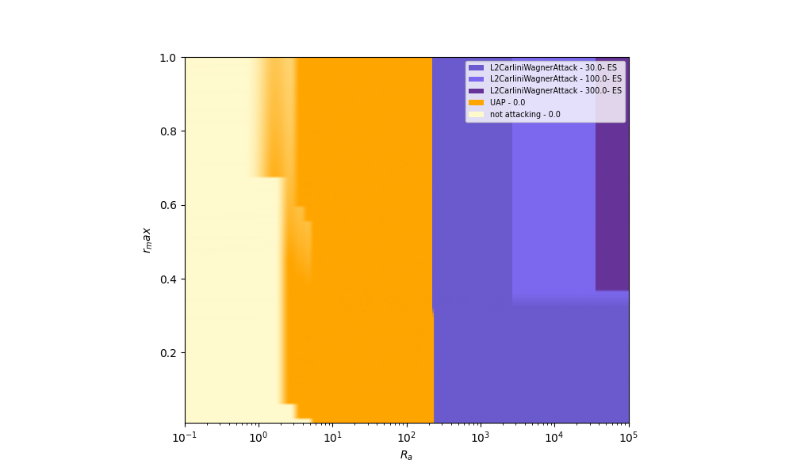  |  

##### Graybox scenario
Adversary             |  Defender
:-------------------------:|:-------------------------:
  |  

##### Blackbox scenario
Adversary             |  Defender
:-------------------------:|:-------------------------:
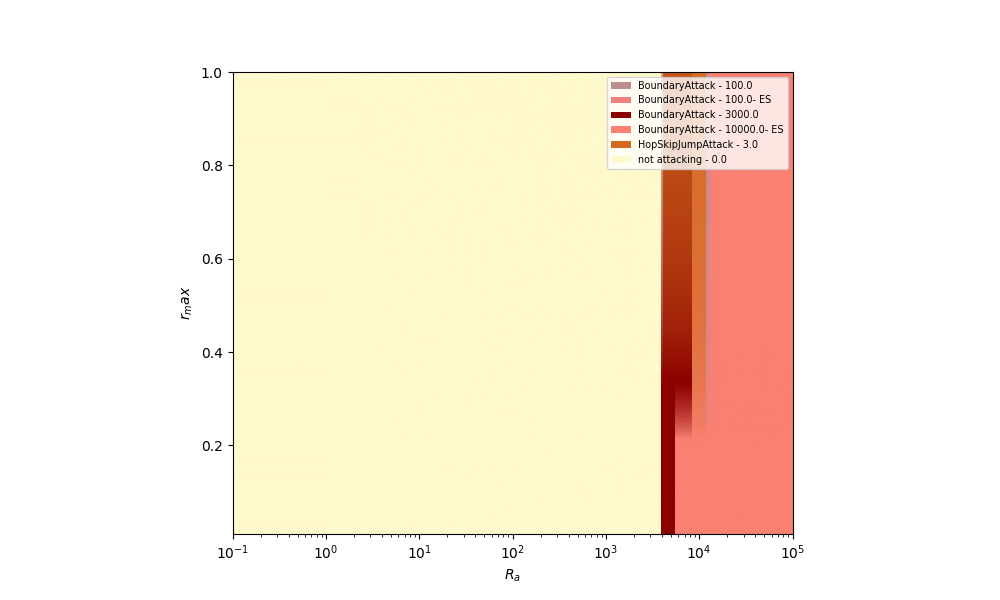  |  

#### DenseNet121
##### Whitebox scenario
Adversary             |  Defender
:-------------------------:|:-------------------------:
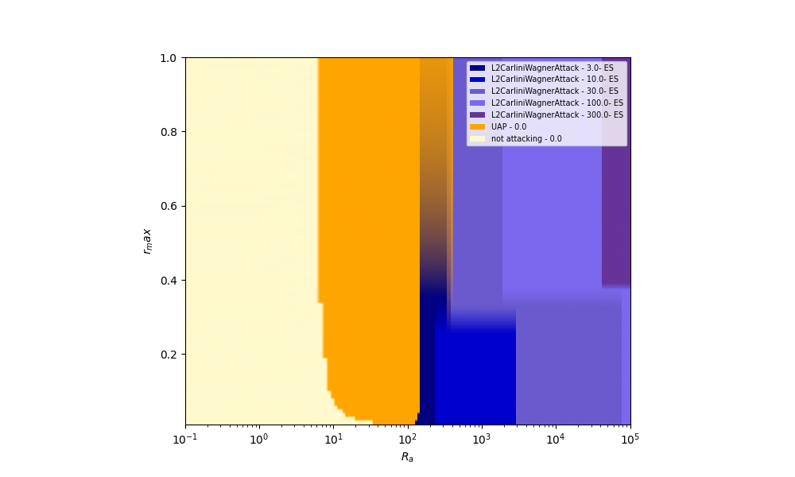  |  

##### Graybox scenario
Adversary             |  Defender
:-------------------------:|:-------------------------:
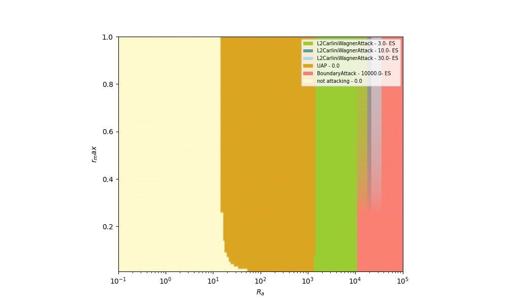  |  

##### Blackbox scenario
Adversary             |  Defender
:-------------------------:|:-------------------------:
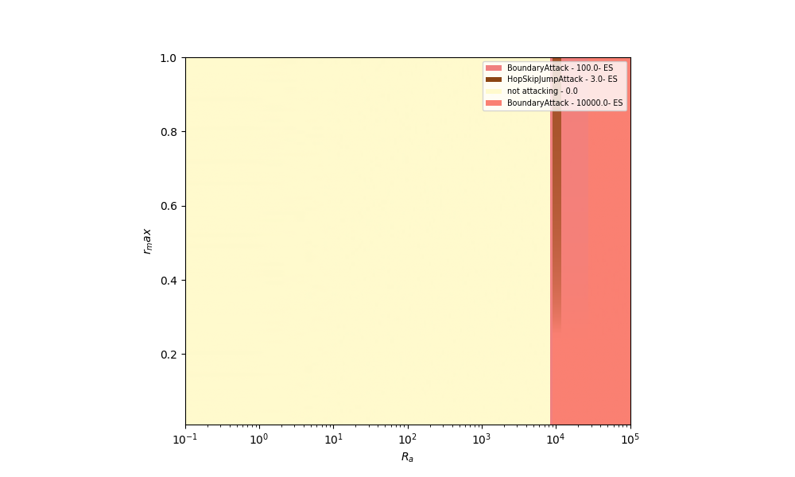  |  

#### MobileNetV2
##### Whitebox scenario
Adversary             |  Defender
:-------------------------:|:-------------------------:
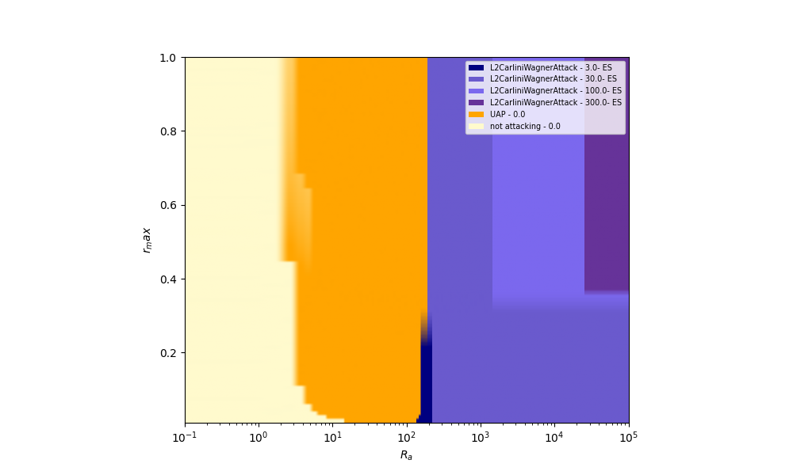  |  

##### Graybox scenario
Adversary             |  Defender
:-------------------------:|:-------------------------:
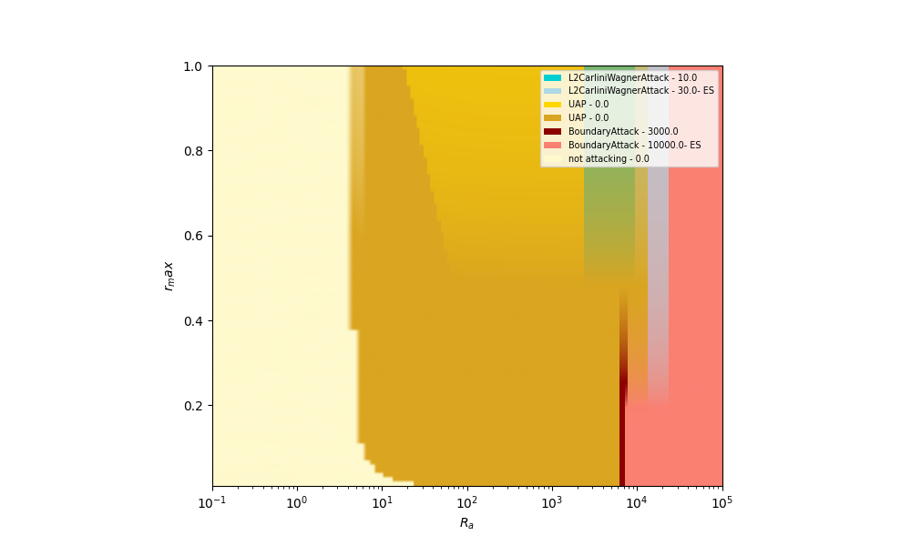  |  

##### Blackbox scenario
Adversary             |  Defender
:-------------------------:|:-------------------------:
  |  

### 6xN Games
#### Whitebox scenario
Adversary             |  Defender
:-------------------------:|:-------------------------:
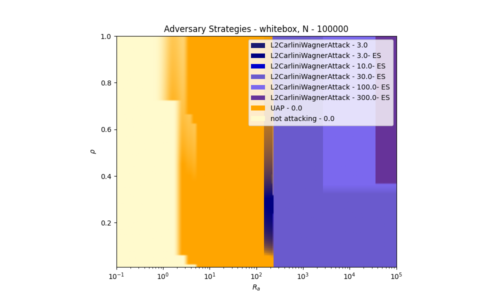  |  

| attack                                |   steps | $R_a$               | $rho$      |
|:--------------------------------------|--------:|:--------------------|:-----------|
| not attacking                         |       0 | 0.1, 4.095          | 0.01, 1.0  |
| UAP                                   |       0 | 0.9, 231.013        | 0.01, 1.0  |
| L2CarliniWagnerAttack \|\| |       3 | 151.991, 231.013    | 0.05, 1.0  |
| L2CarliniWagnerAttack                 |       3 | 215.443, 215.443    | 0.37, 0.4  |
| L2CarliniWagnerAttack \|\| |      10 | 231.013, 231.013    | 0.05, 0.23 |
| L2CarliniWagnerAttack \|\| |      30 | 231.013, 100000.0   | 0.01, 1.0  |
| L2CarliniWagnerAttack \|\| |     100 | 1519.911, 100000.0  | 0.32, 1.0  |
| L2CarliniWagnerAttack \|\| |     300 | 37649.358, 100000.0 | 0.36, 1.0  |

|    | model name        | $R_a$             | $rho$     |
|---:|:------------------|:------------------|:----------|
|  0 | resnet-standard   | 0.1, 100000.0     | 0.01, 1.0 |
|  1 | resnet-robust     | 1.326, 100000.0   | 0.3, 1.0  |
|  2 | densenet-standard | 12.649, 231.013   | 0.05, 1.0 |
|  3 | mobilenet-robust  | 151.991, 2656.088 | 0.71, 1.0 |

#### Graybox scenario
Adversary             |  Defender
:-------------------------:|:-------------------------:
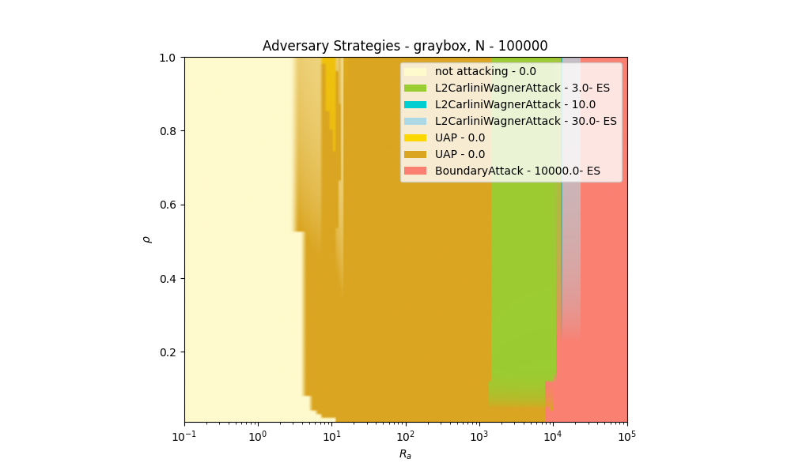  |  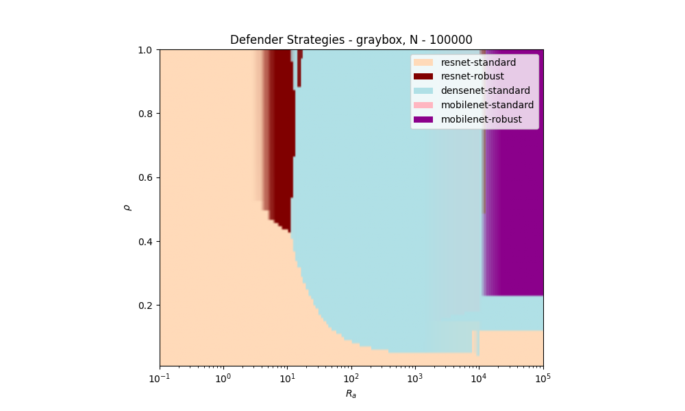

| attack                                                               |   steps | $R_a$                | $rho$     |
|:---------------------------------------------------------------------|--------:|:---------------------|:----------|
| not attacking                                                        |       0 | 0.1, 13.895          | 0.01, 1.0 |
| UAP *=                                         |       0 | 2.812, 11497.57      | 0.01, 1.0 |
| UAP &Dagger;=                                  |       0 | 7.197, 16.768        | 0.75, 1.0 |
| L2CarliniWagnerAttack \|\|*=        |       3 | 1417.474, 12328.467  | 0.05, 1.0 |
| BoundaryAttack \|\|                                       |   10000 | 8111.308, 100000.0   | 0.01, 1.0 |
| L2CarliniWagnerAttack &Dagger;=                |      10 | 12328.467, 13219.411 | 0.23, 1.0 |
| L2CarliniWagnerAttack \|\|&Dagger;= |      30 | 14174.742, 23101.297 | 0.23, 1.0 |

|    | model name         | $R_a$               | $rho$     |
|---:|:-------------------|:--------------------|:----------|
|  0 | resnet-standard    | 0.1, 100000.0       | 0.01, 1.0 |
|  1 | resnet-robust      | 3.089, 12328.467    | 0.43, 1.0 |
|  2 | densenet-standard  | 11.514, 100000.0    | 0.04, 1.0 |
|  3 | mobilenet-standard | 1519.911, 12328.467 | 0.15, 1.0 |
|  4 | mobilenet-robust   | 11497.57, 100000.0  | 0.23, 1.0 |

#### Blackbox scenario

Adversary             |  Defender
:-------------------------:|:-------------------------:
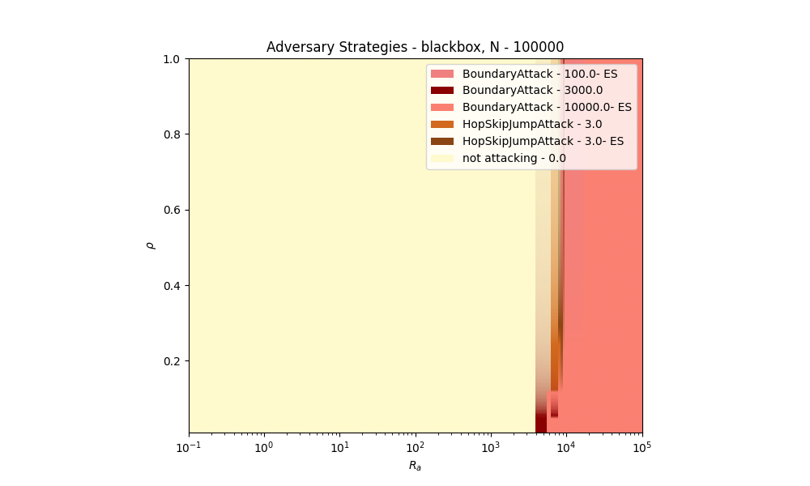  |  

| attack                            |   steps | $R_a$              | $rho$     |
|:----------------------------------|--------:|:-------------------|:----------|
| not attacking                     |       0 | 0.1, 8111.308      | 0.01, 1.0 |
| BoundaryAttack                    |    3000 | 4037.017, 7564.633 | 0.01, 1.0 |
| BoundaryAttack \|\|    |   10000 | 5722.368, 100000.0 | 0.01, 1.0 |
| HopSkipJumpAttack                 |       3 | 6579.332, 8111.308 | 0.12, 1.0 |
| HopSkipJumpAttack \|\| |       3 | 8111.308, 9326.033 | 0.12, 1.0 |
| BoundaryAttack \|\|    |     100 | 8697.49, 16297.508 | 0.23, 1.0 |

|    | model name        | $R_a$              | $rho$     |
|---:|:------------------|:-------------------|:----------|
|  0 | resnet-standard   | 0.1, 100000.0      | 0.01, 1.0 |
|  1 | densenet-standard | 4037.017, 100000.0 | 0.05, 1.0 |
|  2 | mobilenet-robust  | 9326.033, 100000.0 | 0.23, 1.0 |

### Games with higher R_a Range
#### 2xN
##### Whitebox scenario
Adversary             |  Defender
:-------------------------:|:-------------------------:
  |  

##### Graybox scenario
Adversary             |  Defender
:-------------------------:|:-------------------------:
  |  

##### Blackbox scenario

Adversary             |  Defender
:-------------------------:|:-------------------------:
  |  
#### 6xN

##### Whitebox scenario
Adversary             |  Defender
:-------------------------:|:-------------------------:
  |  

##### Graybox scenario
Adversary             |  Defender
:-------------------------:|:-------------------------:
  |  

##### Blackbox scenario

Adversary             |  Defender
:-------------------------:|:-------------------------:
  |  

### Games with alternative R_d values
#### ResNet50 (only) - Whitebox Scenario
##### R_d = R_a (as in the paper)
Adversary             |  Defender
:-------------------------:|:-------------------------:
  |   

##### R_d = 0.1R_a 
Adversary             |  Defender
:-------------------------:|:-------------------------:
  |   

##### R_d = 100
Adversary             |  Defender
:-------------------------:|:-------------------------:
  |   

##### R_d = 1,000
Adversary             |  Defender
:-------------------------:|:-------------------------:
  |   

##### R_d = 10,000
Adversary             |  Defender
:-------------------------:|:-------------------------:
  |   

## Experiment Results (described in the paper, section VI.A).

Legend: 
\|\|: Early Stopping 
*: Transfer Attack; Surrogate model trained with standard training 
&Dagger;: Transfer Attack; Surrogate model trained with adversarial training 
=: Transfer Attack; Surrogate model data matches<be>

Architectures:
Column Names starting with
DN_: DenseNet121
RN_: ResNet50
MN_: MobileNetV2

|     | attack                                                              |   steps |   DN_ongoing_time |   DN_init_time |   DN_total_init_time |   DN_ASR-undefended |   DN_ASR-defended |   DN_acc-defended |   DN_acc-undefended |   RN_init_time |   RN_ongoing_time |   RN_total_init_time |   RN_ASR-undefended |   RN_ASR-defended |   RN_acc-defended |   RN_acc-undefended |   MN_init_time |   MN_ongoing_time |   MN_total_init_time |   MN_ASR-undefended |   MN_ASR-defended |   MN_acc-defended |   MN_acc-undefended |
|----:|:--------------------------------------------------------------------|--------:|------------------:|---------------:|---------------------:|--------------------:|------------------:|------------------:|--------------------:|---------------:|------------------:|---------------------:|--------------------:|------------------:|------------------:|--------------------:|---------------:|------------------:|---------------------:|--------------------:|------------------:|------------------:|--------------------:|
|   0 | 0                                                                   |       0 |            1.7846 |           0    |                 0    |              0.082  |            0.2164 |            0.7836 |              0.918  |          0     |            0.6206 |                 0    |              0.071  |            0.203  |            0.797  |              0.929  |           0    |            0.8307 |                 0    |              0.084  |            0.209  |            0.791  |              0.916  |
|   1 | 0&Dagger;=                                    |       0 |            0.8562 |           0    |             21427    |              0.082  |            0.2164 |            0.7836 |              0.918  |          0     |            0.6174 |             21427    |              0.071  |            0.203  |            0.797  |              0.929  |           0    |            0.7267 |             21427    |              0.084  |            0.209  |            0.791  |              0.916  |
|   2 | 0*=                                           |       0 |            0.8963 |           0    |              2304.8  |              0.082  |            0.2164 |            0.7836 |              0.918  |          0     |            0.8408 |              2304.8  |              0.071  |            0.203  |            0.797  |              0.929  |           0    |            0.7573 |              2304.8  |              0.084  |            0.209  |            0.791  |              0.916  |
|   3 | BoundaryAttack                                                      |     100 |          815.265  |           0    |                 0    |              0.0942 |            0.2304 |            0.7696 |              0.9058 |          0     |          512.732  |                 0    |              0.107  |            0.2136 |            0.7864 |              0.893  |           0    |           94.2943 |                 0    |              0.1342 |            0.2164 |            0.7836 |              0.8658 |
|   4 | BoundaryAttack&Dagger;=                       |     100 |          140.279  |           0    |             21427    |              0.0814 |            0.217  |            0.783  |              0.9186 |          0     |           91.4672 |             21427    |              0.0768 |            0.2028 |            0.7972 |              0.9232 |           0    |          156.801  |             21427    |              0.0986 |            0.2078 |            0.7922 |              0.9014 |
|   5 | BoundaryAttack*=                              |     100 |          812.051  |           0    |              2304.8  |              0.0836 |            0.2016 |            0.7984 |              0.9164 |          0     |          223.449  |              2304.8  |              0.0768 |            0.2    |            0.8    |              0.9232 |           0    |           83.9272 |              2304.8  |              0.1048 |            0.2052 |            0.7948 |              0.8952 |
|   6 | BoundaryAttack\|\|                                       |     100 |          814.107  |           0    |                 0    |              0.097  |            0.231  |            0.769  |              0.903  |          0     |          514.081  |                 0    |              0.1002 |            0.2144 |            0.7856 |              0.8998 |           0    |           94.209  |                 0    |              0.1394 |            0.2168 |            0.7832 |              0.8606 |
|   7 | BoundaryAttack\|\|&Dagger;=        |     100 |          136.825  |           0    |             21427    |              0.0826 |            0.2168 |            0.7832 |              0.9174 |          0     |           89.2146 |             21427    |              0.0768 |            0.203  |            0.797  |              0.9232 |           0    |          154.408  |             21427    |              0.1004 |            0.2094 |            0.7906 |              0.8996 |
|   8 | BoundaryAttack\|\|*=               |     100 |          812.991  |           0    |              2304.8  |              0.0844 |            0.202  |            0.798  |              0.9156 |          0     |          252.186  |              2304.8  |              0.0792 |            0.1996 |            0.8004 |              0.9208 |           0    |           84.7088 |              2304.8  |              0.1016 |            0.2022 |            0.7978 |              0.8984 |
|   9 | BoundaryAttack                                                      |     300 |          964.044  |           0    |                 0    |              0.103  |            0.2304 |            0.7696 |              0.897  |          0     |          616.462  |                 0    |              0.111  |            0.2152 |            0.7848 |              0.889  |           0    |          206.599  |                 0    |              0.1496 |            0.2174 |            0.7826 |              0.8504 |
|  10 | BoundaryAttack&Dagger;=                       |     300 |          296.775  |           0    |             21427    |              0.0816 |            0.2166 |            0.7834 |              0.9184 |          0     |          192.377  |             21427    |              0.0788 |            0.2006 |            0.7994 |              0.9212 |           0    |          264.399  |             21427    |              0.0996 |            0.2086 |            0.7914 |              0.9004 |
|  11 | BoundaryAttack*=                              |     300 |          959.196  |           0    |              2304.8  |              0.0824 |            0.2014 |            0.7986 |              0.9176 |          0     |          343.259  |              2304.8  |              0.0812 |            0.1982 |            0.8018 |              0.9188 |           0    |          195.818  |              2304.8  |              0.1046 |            0.2044 |            0.7956 |              0.8954 |
|  12 | BoundaryAttack\|\|                                       |     300 |          964.504  |           0    |                 0    |              0.0988 |            0.2304 |            0.7696 |              0.9012 |          0     |          613.283  |                 0    |              0.1098 |            0.2166 |            0.7834 |              0.8902 |           0    |          207.838  |                 0    |              0.1476 |            0.2176 |            0.7824 |              0.8524 |
|  13 | BoundaryAttack\|\|&Dagger;=        |     300 |          302.123  |           0    |             21427    |              0.081  |            0.2178 |            0.7822 |              0.919  |          0     |          194.485  |             21427    |              0.0764 |            0.203  |            0.797  |              0.9236 |           0    |          258.894  |             21427    |              0.102  |            0.2088 |            0.7912 |              0.898  |
|  14 | BoundaryAttack\|\|*=               |     300 |          959.319  |           0    |              2304.8  |              0.0842 |            0.2002 |            0.7998 |              0.9158 |          0     |          352.514  |              2304.8  |              0.0814 |            0.2002 |            0.7998 |              0.9186 |           0    |          196.982  |              2304.8  |              0.1042 |            0.2034 |            0.7966 |              0.8958 |
|  15 | BoundaryAttack                                                      |    1000 |         1488.53   |           0    |                 0    |              0.1182 |            0.2354 |            0.7646 |              0.8818 |          0     |          980.474  |                 0    |              0.143  |            0.2206 |            0.7794 |              0.857  |           0    |          597.157  |                 0    |              0.1962 |            0.2202 |            0.7798 |              0.8038 |
|  16 | BoundaryAttack&Dagger;=                       |    1000 |          858.114  |           0    |             21427    |              0.081  |            0.2166 |            0.7834 |              0.919  |          0     |          552.779  |             21427    |              0.0776 |            0.2036 |            0.7964 |              0.9224 |           0    |          662.444  |             21427    |              0.1002 |            0.2084 |            0.7916 |              0.8998 |
|  17 | BoundaryAttack*=                              |    1000 |         1473.08   |           0    |              2304.8  |              0.0858 |            0.2018 |            0.7982 |              0.9142 |          0     |          680.825  |              2304.8  |              0.0894 |            0.2016 |            0.7984 |              0.9106 |           0    |          587.922  |              2304.8  |              0.1086 |            0.2052 |            0.7948 |              0.8914 |
|  18 | BoundaryAttack\|\|                                       |    1000 |         1490.62   |           0    |                 0    |              0.12   |            0.2366 |            0.7634 |              0.88   |          0     |          981.101  |                 0    |              0.141  |            0.2204 |            0.7796 |              0.859  |           0    |          599.397  |                 0    |              0.1982 |            0.219  |            0.781  |              0.8018 |
|  19 | BoundaryAttack\|\|&Dagger;=        |    1000 |          859.18   |           0    |             21427    |              0.0826 |            0.219  |            0.781  |              0.9174 |          0     |          556.442  |             21427    |              0.076  |            0.2046 |            0.7954 |              0.924  |           0    |          659.154  |             21427    |              0.101  |            0.2094 |            0.7906 |              0.899  |
|  20 | BoundaryAttack\|\|*=               |    1000 |         1475.56   |           0    |              2304.8  |              0.0862 |            0.2008 |            0.7992 |              0.9138 |          0     |          698.248  |              2304.8  |              0.0864 |            0.2016 |            0.7984 |              0.9136 |           0    |          590.358  |              2304.8  |              0.1076 |            0.2044 |            0.7956 |              0.8924 |
|  21 | BoundaryAttack                                                      |    3000 |         3000.69   |           0    |                 0    |              0.2918 |            0.2732 |            0.7268 |              0.7082 |          0     |         2011.31   |                 0    |              0.52   |            0.2574 |            0.7426 |              0.48   |           0    |         1720.3    |                 0    |              0.6212 |            0.2488 |            0.7512 |              0.3788 |
|  22 | BoundaryAttack&Dagger;=                       |    3000 |         2460.98   |           0    |             21427    |              0.0838 |            0.2248 |            0.7752 |              0.9162 |          0     |         1589.75   |             21427    |              0.0802 |            0.2168 |            0.7832 |              0.9198 |           0    |         1770.88   |             21427    |              0.1034 |            0.2172 |            0.7828 |              0.8966 |
|  23 | BoundaryAttack*=                              |    3000 |         2943.36   |           0    |              2304.8  |              0.1088 |            0.2056 |            0.7944 |              0.8912 |          0     |         1729.58   |              2304.8  |              0.114  |            0.2034 |            0.7966 |              0.886  |           0    |         1711.73   |              2304.8  |              0.1134 |            0.208  |            0.792  |              0.8866 |
|  24 | BoundaryAttack\|\|                                       |    3000 |         3003.34   |           0    |                 0    |              0.2894 |            0.2732 |            0.7268 |              0.7106 |          0     |         2016.09   |                 0    |              0.5122 |            0.256  |            0.744  |              0.4878 |           0    |         1725.27   |                 0    |              0.6168 |            0.2506 |            0.7494 |              0.3832 |
|  25 | BoundaryAttack\|\|&Dagger;=        |    3000 |         2466.99   |           0    |             21427    |              0.0836 |            0.2254 |            0.7746 |              0.9164 |          0     |         1595.03   |             21427    |              0.0794 |            0.2164 |            0.7836 |              0.9206 |           0    |         1781.46   |             21427    |              0.1012 |            0.2178 |            0.7822 |              0.8988 |
|  26 | BoundaryAttack\|\|*=               |    3000 |         2952.42   |           0    |              2304.8  |              0.108  |            0.204  |            0.796  |              0.892  |          0     |         1716.39   |              2304.8  |              0.1112 |            0.2044 |            0.7956 |              0.8888 |           0    |         1716.93   |              2304.8  |              0.1124 |            0.2086 |            0.7914 |              0.8876 |
|  27 | BoundaryAttack                                                      |   10000 |         8277.73   |           0    |                 0    |              0.9076 |            0.5018 |            0.4982 |              0.0924 |          0     |         5620.54   |                 0    |              0.9948 |            0.4936 |            0.5064 |              0.0052 |           0    |         5652.09   |                 0    |              0.9994 |            0.467  |            0.533  |              0.0006 |
|  28 | BoundaryAttack&Dagger;=                       |   10000 |         8080.27   |           0    |             21427    |              0.0976 |            0.267  |            0.733  |              0.9024 |          0     |         5222.56   |             21427    |              0.092  |            0.2658 |            0.7342 |              0.908  |           0    |         5712.46   |             21427    |              0.126  |            0.2642 |            0.7358 |              0.874  |
|  29 | BoundaryAttack*=                              |   10000 |         8101      |           0    |              2304.8  |              0.1228 |            0.2054 |            0.7946 |              0.8772 |          0     |         5352.57   |              2304.8  |              0.1102 |            0.2038 |            0.7962 |              0.8898 |           0    |         5645.97   |              2304.8  |              0.1054 |            0.2102 |            0.7898 |              0.8946 |
|  30 | BoundaryAttack\|\|                                       |   10000 |         8175.25   |           0    |                 0    |              0.9066 |            0.501  |            0.499  |              0.0934 |          0     |         4722.41   |                 0    |              0.9938 |            0.4936 |            0.5064 |              0.0062 |           0    |         4389.89   |                 0    |              0.9994 |            0.464  |            0.536  |              0.0006 |
|  31 | BoundaryAttack\|\|&Dagger;=        |   10000 |         8098.96   |           0    |             21427    |              0.0984 |            0.2662 |            0.7338 |              0.9016 |          0     |         5230.31   |             21427    |              0.0914 |            0.2646 |            0.7354 |              0.9086 |           0    |         5734.47   |             21427    |              0.121  |            0.2634 |            0.7366 |              0.879  |
|  32 | BoundaryAttack\|\|*=               |   10000 |         8094.77   |           0    |              2304.8  |              0.1204 |            0.206  |            0.794  |              0.8796 |          0     |         4384.09   |              2304.8  |              0.1096 |            0.2042 |            0.7958 |              0.8904 |           0    |         4550.24   |              2304.8  |              0.1096 |            0.2098 |            0.7902 |              0.8904 |
|  33 | HopSkipJumpAttack                                                   |       3 |         1061.91   |           0    |                 0    |              0.124  |            0.239  |            0.761  |              0.876  |          0     |          688.013  |                 0    |              0.1598 |            0.2234 |            0.7766 |              0.8402 |           0    |          276.168  |                 0    |              0.222  |            0.2238 |            0.7762 |              0.778  |
|  34 | HopSkipJumpAttack&Dagger;=                    |       3 |          404.834  |           0    |             21427    |              0.0812 |            0.2194 |            0.7806 |              0.9188 |          0     |          258.997  |             21427    |              0.0786 |            0.206  |            0.794  |              0.9214 |           0    |          330.421  |             21427    |              0.0994 |            0.2124 |            0.7876 |              0.9006 |
|  35 | HopSkipJumpAttack*=                           |       3 |         1054.3    |           0    |              2304.8  |              0.0888 |            0.2008 |            0.7992 |              0.9112 |          0     |          405.467  |              2304.8  |              0.0892 |            0.2026 |            0.7974 |              0.9108 |           0    |          266.816  |              2304.8  |              0.1092 |            0.2064 |            0.7936 |              0.8908 |
|  36 | HopSkipJumpAttack\|\|                                    |       3 |         1061.28   |           0    |                 0    |              0.125  |            0.2384 |            0.7616 |              0.875  |          0     |          686.346  |                 0    |              0.152  |            0.222  |            0.778  |              0.848  |           0    |          276.307  |                 0    |              0.2216 |            0.2244 |            0.7756 |              0.7784 |
|  37 | HopSkipJumpAttack\|\|&Dagger;=     |       3 |          406.896  |           0    |             21427    |              0.0828 |            0.2188 |            0.7812 |              0.9172 |          0     |          260.766  |             21427    |              0.078  |            0.207  |            0.793  |              0.922  |           0    |          338.297  |             21427    |              0.103  |            0.2114 |            0.7886 |              0.897  |
|  38 | HopSkipJumpAttack\|\|*=            |       3 |         1053.54   |           0    |              2304.8  |              0.0888 |            0.1994 |            0.8006 |              0.9112 |          0     |          391.659  |              2304.8  |              0.0916 |            0.2002 |            0.7998 |              0.9084 |           0    |          266.289  |              2304.8  |              0.1098 |            0.2088 |            0.7912 |              0.8902 |
|  39 | HopSkipJumpAttack                                                   |      10 |         2352.09   |           0    |                 0    |              0.2032 |            0.2536 |            0.7464 |              0.7968 |          0     |         1570.57   |                 0    |              0.3204 |            0.2402 |            0.7598 |              0.6796 |           0    |         1226.8    |                 0    |              0.419  |            0.2424 |            0.7576 |              0.581  |
|  40 | HopSkipJumpAttack&Dagger;=                    |      10 |         1792.71   |           0    |             21427    |              0.0824 |            0.222  |            0.778  |              0.9176 |          0     |         1152.45   |             21427    |              0.0782 |            0.2108 |            0.7892 |              0.9218 |           0    |         1285.2    |             21427    |              0.0996 |            0.2152 |            0.7848 |              0.9004 |
|  41 | HopSkipJumpAttack*=                           |      10 |         2313.36   |           0    |              2304.8  |              0.1002 |            0.2038 |            0.7962 |              0.8998 |          0     |         1273.93   |              2304.8  |              0.1068 |            0.2044 |            0.7956 |              0.8932 |           0    |         1215.21   |              2304.8  |              0.113  |            0.2074 |            0.7926 |              0.887  |
|  42 | HopSkipJumpAttack\|\|                                    |      10 |         2358.89   |           0    |                 0    |              0.2066 |            0.255  |            0.745  |              0.7934 |          0     |         1563.36   |                 0    |              0.3154 |            0.2396 |            0.7604 |              0.6846 |           0    |         1224.27   |                 0    |              0.4212 |            0.2428 |            0.7572 |              0.5788 |
|  43 | HopSkipJumpAttack\|\|&Dagger;=     |      10 |         1790.82   |           0    |             21427    |              0.0834 |            0.2246 |            0.7754 |              0.9166 |          0     |         1151.91   |             21427    |              0.0798 |            0.2122 |            0.7878 |              0.9202 |           0    |         1288.43   |             21427    |              0.1004 |            0.2138 |            0.7862 |              0.8996 |
|  44 | HopSkipJumpAttack\|\|*=            |      10 |         2315.47   |           0    |              2304.8  |              0.1022 |            0.2038 |            0.7962 |              0.8978 |          0     |         1271.23   |              2304.8  |              0.1036 |            0.2026 |            0.7974 |              0.8964 |           0    |         1216.11   |              2304.8  |              0.117  |            0.2078 |            0.7922 |              0.883  |
|  45 | HopSkipJumpAttack                                                   |      30 |         8500.78   |           0    |                 0    |              0.402  |            0.291  |            0.709  |              0.598  |          0     |         5750.36   |                 0    |              0.6542 |            0.2744 |            0.7256 |              0.3458 |           0    |         5727.14   |                 0    |              0.7538 |            0.281  |            0.719  |              0.2462 |
|  46 | HopSkipJumpAttack&Dagger;=                    |      30 |         8368.69   |           0    |             21427    |              0.0858 |            0.2294 |            0.7706 |              0.9142 |          0     |         5369.23   |             21427    |              0.082  |            0.2232 |            0.7768 |              0.918  |           0    |         5828.9    |             21427    |              0.1092 |            0.2256 |            0.7744 |              0.8908 |
|  47 | HopSkipJumpAttack*=                           |      30 |         8286.71   |           0    |              2304.8  |              0.1166 |            0.2062 |            0.7938 |              0.8834 |          0     |         5468.4    |              2304.8  |              0.1186 |            0.2024 |            0.7976 |              0.8814 |           0    |         5713.91   |              2304.8  |              0.1102 |            0.2088 |            0.7912 |              0.8898 |
|  48 | HopSkipJumpAttack\|\|                                    |      30 |         8378.71   |           0    |                 0    |              0.4028 |            0.2926 |            0.7074 |              0.5972 |          0     |         5699.72   |                 0    |              0.6572 |            0.275  |            0.725  |              0.3428 |           0    |         5682.14   |                 0    |              0.7452 |            0.2822 |            0.7178 |              0.2548 |
|  49 | HopSkipJumpAttack\|\|&Dagger;=     |      30 |         8365.71   |           0    |             21427    |              0.0854 |            0.2306 |            0.7694 |              0.9146 |          0     |         5370.36   |             21427    |              0.0814 |            0.2234 |            0.7766 |              0.9186 |           0    |         5832.88   |             21427    |              0.1058 |            0.2236 |            0.7764 |              0.8942 |
|  50 | HopSkipJumpAttack\|\|*=            |      30 |         8227.41   |           0    |              2304.8  |              0.1176 |            0.205  |            0.795  |              0.8824 |          0     |         5460.33   |              2304.8  |              0.117  |            0.2026 |            0.7974 |              0.883  |           0    |         5673.38   |              2304.8  |              0.1094 |            0.2086 |            0.7914 |              0.8906 |
|  51 | HopSkipJumpAttack                                                   |     100 |        45902.3    |           0    |                 0    |              0.7482 |            0.3718 |            0.6282 |              0.2518 |          0     |        31287.3    |                 0    |              0.949  |            0.3566 |            0.6434 |              0.051  |           0    |        33269.8    |                 0    |              0.9804 |            0.3624 |            0.6376 |              0.0196 |
|  52 | HopSkipJumpAttack&Dagger;=                    |     100 |        48578.9    |           0    |             21427    |              0.0924 |            0.249  |            0.751  |              0.9076 |          0     |        31092.7    |             21427    |              0.0872 |            0.2402 |            0.7598 |              0.9128 |           0    |        33533.2    |             21427    |              0.1118 |            0.2442 |            0.7558 |              0.8882 |
|  53 | HopSkipJumpAttack*=                           |     100 |        45024.4    |           0    |              2304.8  |              0.1246 |            0.2092 |            0.7908 |              0.8754 |          0     |        31024.8    |              2304.8  |              0.117  |            0.2044 |            0.7956 |              0.883  |           0    |        33260.2    |              2304.8  |              0.1084 |            0.21   |            0.79   |              0.8916 |
|  54 | HopSkipJumpAttack\|\|                                    |     100 |        45364.8    |           0    |                 0    |              0.7484 |            0.3764 |            0.6236 |              0.2516 |          0     |        31051.2    |                 0    |              0.9528 |            0.3548 |            0.6452 |              0.0472 |           0    |        32122.3    |                 0    |              0.9812 |            0.3626 |            0.6374 |              0.0188 |
|  55 | HopSkipJumpAttack\|\|&Dagger;=     |     100 |        48588.2    |           0    |             21427    |              0.0908 |            0.249  |            0.751  |              0.9092 |          0     |        31081.3    |             21427    |              0.0868 |            0.2408 |            0.7592 |              0.9132 |           0    |        33519.6    |             21427    |              0.1108 |            0.2434 |            0.7566 |              0.8892 |
|  56 | HopSkipJumpAttack\|\|*=            |     100 |        44076.7    |           0    |              2304.8  |              0.1226 |            0.2064 |            0.7936 |              0.8774 |          0     |        30833.3    |              2304.8  |              0.1136 |            0.204  |            0.796  |              0.8864 |           0    |        32702.3    |              2304.8  |              0.109  |            0.2096 |            0.7904 |              0.891  |
|  57 | L2CarliniWagnerAttack                                               |       3 |           56.4993 |           0    |                 0    |              0.5748 |            0.3252 |            0.6748 |              0.4252 |          0     |           57.7459 |                 0    |              0.6306 |            0.314  |            0.686  |              0.3694 |           0    |           48.2203 |                 0    |              0.7792 |            0.31   |            0.69   |              0.2208 |
|  58 | L2CarliniWagnerAttack&Dagger;=                |       3 |           57.1834 |           0    |             21427    |              0.0806 |            0.2242 |            0.7758 |              0.9194 |          0     |           58.2565 |             21427    |              0.071  |            0.2104 |            0.7896 |              0.929  |           0    |           44.9828 |             21427    |              0.0854 |            0.219  |            0.781  |              0.9146 |
|  59 | L2CarliniWagnerAttack*=                       |       3 |           57.6351 |           0    |              2304.8  |              0.166  |            0.2184 |            0.7816 |              0.834  |          0     |           58.4388 |              2304.8  |              0.2338 |            0.2032 |            0.7968 |              0.7662 |           0    |           48.5627 |              2304.8  |              0.157  |            0.2102 |            0.7898 |              0.843  |
|  60 | L2CarliniWagnerAttack\|\|                                |       3 |           56.015  |           0    |                 0    |              0.5748 |            0.3252 |            0.6748 |              0.4252 |          0     |           57.9466 |                 0    |              0.6306 |            0.314  |            0.686  |              0.3694 |           0    |           47.9582 |                 0    |              0.7792 |            0.31   |            0.69   |              0.2208 |
|  61 | L2CarliniWagnerAttack\|\|&Dagger;= |       3 |           57.3317 |           0    |             21427    |              0.0806 |            0.2242 |            0.7758 |              0.9194 |          0     |           58.5046 |             21427    |              0.071  |            0.2104 |            0.7896 |              0.929  |           0    |           45.1268 |             21427    |              0.0854 |            0.219  |            0.781  |              0.9146 |
|  62 | L2CarliniWagnerAttack\|\|*=        |       3 |           57.3112 |           0    |              2304.8  |              0.166  |            0.2184 |            0.7816 |              0.834  |          0     |           58.0223 |              2304.8  |              0.2338 |            0.2032 |            0.7968 |              0.7662 |           0    |           48.4384 |              2304.8  |              0.1572 |            0.2102 |            0.7898 |              0.8428 |
|  63 | L2CarliniWagnerAttack                                               |      10 |          157.23   |           0    |                 0    |              0.983  |            0.587  |            0.413  |              0.017  |          0     |          161.208  |                 0    |              0.9928 |            0.5822 |            0.4178 |              0.0072 |           0    |          129.641  |                 0    |              0.9936 |            0.5804 |            0.4196 |              0.0064 |
|  64 | L2CarliniWagnerAttack&Dagger;=                |      10 |          156.245  |           0    |             21427    |              0.098  |            0.271  |            0.729  |              0.902  |          0     |          158.81   |             21427    |              0.0846 |            0.2628 |            0.7372 |              0.9154 |           0    |          121.517  |             21427    |              0.1002 |            0.2654 |            0.7346 |              0.8998 |
|  65 | L2CarliniWagnerAttack*=                       |      10 |          160.349  |           0    |              2304.8  |              0.1346 |            0.2192 |            0.7808 |              0.8654 |          0     |          161.7    |              2304.8  |              0.1666 |            0.2054 |            0.7946 |              0.8334 |           0    |          115.723  |              2304.8  |              0.129  |            0.21   |            0.79   |              0.871  |
|  66 | L2CarliniWagnerAttack\|\|                                |      10 |          155.13   |           0    |                 0    |              0.983  |            0.587  |            0.413  |              0.017  |          0     |          125.086  |                 0    |              0.9928 |            0.5822 |            0.4178 |              0.0072 |           0    |          103.322  |                 0    |              0.9936 |            0.5804 |            0.4196 |              0.0064 |
|  67 | L2CarliniWagnerAttack\|\|&Dagger;= |      10 |          155.984  |           0    |             21427    |              0.098  |            0.271  |            0.729  |              0.902  |          0     |          159.346  |             21427    |              0.0848 |            0.2626 |            0.7374 |              0.9152 |           0    |          121.783  |             21427    |              0.1006 |            0.2652 |            0.7348 |              0.8994 |
|  68 | L2CarliniWagnerAttack\|\|*=        |      10 |          159.19   |           0    |              2304.8  |              0.1346 |            0.2192 |            0.7808 |              0.8654 |          0     |          149.025  |              2304.8  |              0.178  |            0.2052 |            0.7948 |              0.822  |           0    |           72.1211 |              2304.8  |              0.141  |            0.2098 |            0.7902 |              0.859  |
|  69 | L2CarliniWagnerAttack                                               |      30 |          403.122  |           0    |                 0    |              0.9986 |            0.7188 |            0.2812 |              0.0014 |          0     |          306.822  |                 0    |              0.9996 |            0.7186 |            0.2814 |              0.0004 |           0    |          210.315  |                 0    |              0.9994 |            0.7156 |            0.2844 |              0.0006 |
|  70 | L2CarliniWagnerAttack&Dagger;=                |      30 |          485.083  |           0    |             21427    |              0.1036 |            0.2886 |            0.7114 |              0.8964 |          0     |          490.794  |             21427    |              0.0916 |            0.2802 |            0.7198 |              0.9084 |           0    |          362.02   |             21427    |              0.1136 |            0.2908 |            0.7092 |              0.8864 |
|  71 | L2CarliniWagnerAttack*=                       |      30 |          432.377  |           0    |              2304.8  |              0.1258 |            0.2186 |            0.7814 |              0.8742 |          0     |          329.291  |              2304.8  |              0.1224 |            0.2042 |            0.7958 |              0.8776 |           0    |          168.648  |              2304.8  |              0.1158 |            0.2092 |            0.7908 |              0.8842 |
|  72 | L2CarliniWagnerAttack\|\|                                |      30 |          202.142  |           0    |                 0    |              0.9986 |            0.7188 |            0.2812 |              0.0014 |          0     |          111.909  |                 0    |              0.9998 |            0.7186 |            0.2814 |              0.0002 |           0    |           97.559  |                 0    |              0.9994 |            0.716  |            0.284  |              0.0006 |
|  73 | L2CarliniWagnerAttack\|\|&Dagger;= |      30 |          486.712  |           0    |             21427    |              0.1036 |            0.289  |            0.711  |              0.8964 |          0     |          491.783  |             21427    |              0.0914 |            0.281  |            0.719  |              0.9086 |           0    |          362.619  |             21427    |              0.1128 |            0.2916 |            0.7084 |              0.8872 |
|  74 | L2CarliniWagnerAttack\|\|*=        |      30 |          242.847  |           0    |              2304.8  |              0.129  |            0.2186 |            0.7814 |              0.871  |          0     |          134.405  |              2304.8  |              0.1334 |            0.2042 |            0.7958 |              0.8666 |           0    |           67.2815 |              2304.8  |              0.1198 |            0.2092 |            0.7908 |              0.8802 |
|  75 | L2CarliniWagnerAttack                                               |     100 |         1457.94   |           0    |                 0    |              1      |            0.7756 |            0.2244 |              0      |          0     |          928.394  |                 0    |              1      |            0.765  |            0.235  |              0      |           0    |          664.034  |                 0    |              1      |            0.773  |            0.227  |              0      |
|  76 | L2CarliniWagnerAttack&Dagger;=                |     100 |         1580.68   |           0    |             21427    |              0.1046 |            0.2942 |            0.7058 |              0.8954 |          0     |         1608      |             21427    |              0.0936 |            0.2852 |            0.7148 |              0.9064 |           0    |         1281.09   |             21427    |              0.1192 |            0.2976 |            0.7024 |              0.8808 |
|  77 | L2CarliniWagnerAttack*=                       |     100 |         1482.78   |           0    |              2304.8  |              0.1236 |            0.2184 |            0.7816 |              0.8764 |          0     |          939.277  |              2304.8  |              0.1194 |            0.204  |            0.796  |              0.8806 |           0    |          517.867  |              2304.8  |              0.1084 |            0.2094 |            0.7906 |              0.8916 |
|  78 | L2CarliniWagnerAttack\|\|                                |     100 |          313.538  |           0    |                 0    |              1      |            0.7758 |            0.2242 |              0      |          0     |          240.337  |                 0    |              1      |            0.765  |            0.235  |              0      |           0    |          178.964  |                 0    |              1      |            0.7726 |            0.2274 |              0      |
|  79 | L2CarliniWagnerAttack\|\|&Dagger;= |     100 |         1579.24   |           0    |             21427    |              0.1056 |            0.294  |            0.706  |              0.8944 |          0     |         1606.42   |             21427    |              0.0928 |            0.2856 |            0.7144 |              0.9072 |           0    |         1280.18   |             21427    |              0.1194 |            0.2972 |            0.7028 |              0.8806 |
|  80 | L2CarliniWagnerAttack\|\|*=        |     100 |          415.687  |           0    |              2304.8  |              0.1268 |            0.2184 |            0.7816 |              0.8732 |          0     |          243.85   |              2304.8  |              0.1262 |            0.2042 |            0.7958 |              0.8738 |           0    |          149.371  |              2304.8  |              0.111  |            0.2094 |            0.7906 |              0.889  |
|  81 | L2CarliniWagnerAttack                                               |     300 |         3203.34   |           0    |                 0    |              1      |            0.7848 |            0.2152 |              0      |          0     |         3091.5    |                 0    |              1      |            0.7746 |            0.2254 |              0      |           0    |         2268.17   |                 0    |              1      |            0.783  |            0.217  |              0      |
|  82 | L2CarliniWagnerAttack&Dagger;=                |     300 |         4580.65   |           0    |             21427    |              0.1062 |            0.2954 |            0.7046 |              0.8938 |          0     |         4661.22   |             21427    |              0.0954 |            0.287  |            0.713  |              0.9046 |           0    |         3700.47   |             21427    |              0.12   |            0.2976 |            0.7024 |              0.88   |
|  83 | L2CarliniWagnerAttack*=                       |     300 |         3174.2    |           0    |              2304.8  |              0.1232 |            0.2184 |            0.7816 |              0.8768 |          0     |         3297.9    |              2304.8  |              0.114  |            0.2038 |            0.7962 |              0.886  |           0    |         2172      |              2304.8  |              0.1068 |            0.2094 |            0.7906 |              0.8932 |
|  84 | L2CarliniWagnerAttack\|\|                                |     300 |          692.142  |           0    |                 0    |              1      |            0.7846 |            0.2154 |              0      |          0     |          608.504  |                 0    |              1      |            0.7748 |            0.2252 |              0      |           0    |          447.518  |                 0    |              1      |            0.7834 |            0.2166 |              0      |
|  85 | L2CarliniWagnerAttack\|\|&Dagger;= |     300 |         4622.98   |           0    |             21427    |              0.1054 |            0.2956 |            0.7044 |              0.8946 |          0     |         4692.16   |             21427    |              0.0952 |            0.2874 |            0.7126 |              0.9048 |           0    |         3694.64   |             21427    |              0.1206 |            0.2982 |            0.7018 |              0.8794 |
|  86 | L2CarliniWagnerAttack\|\|*=        |     300 |          874.296  |           0    |              2304.8  |              0.125  |            0.2184 |            0.7816 |              0.875  |          0     |          629.382  |              2304.8  |              0.1212 |            0.2042 |            0.7958 |              0.8788 |           0    |          403.404  |              2304.8  |              0.1086 |            0.2094 |            0.7906 |              0.8914 |
|  87 | L2CarliniWagnerAttack                                               |    1000 |         7770.55   |           0    |                 0    |              1      |            0.7874 |            0.2126 |              0      |          0     |         7902.71   |                 0    |              1      |            0.7764 |            0.2236 |              0      |           0    |         5683.83   |                 0    |              1      |            0.7872 |            0.2128 |              0      |
|  88 | L2CarliniWagnerAttack&Dagger;=                |    1000 |        12673.5    |           0    |             21427    |              0.1058 |            0.2952 |            0.7048 |              0.8942 |          0     |        12737.2    |             21427    |              0.0954 |            0.2864 |            0.7136 |              0.9046 |           0    |         9949.96   |             21427    |              0.121  |            0.298  |            0.702  |              0.879  |
|  89 | L2CarliniWagnerAttack*=                       |    1000 |         8010.41   |           0    |              2304.8  |              0.1226 |            0.2184 |            0.7816 |              0.8774 |          0     |         8051.67   |              2304.8  |              0.1142 |            0.2038 |            0.7962 |              0.8858 |           0    |         5405.1    |              2304.8  |              0.1074 |            0.2094 |            0.7906 |              0.8926 |
|  90 | L2CarliniWagnerAttack\|\|                                |    1000 |         1286.01   |           0    |                 0    |              1      |            0.7872 |            0.2128 |              0      |          0     |         1261.09   |                 0    |              1      |            0.777  |            0.223  |              0      |           0    |          945.071  |                 0    |              1      |            0.787  |            0.213  |              0      |
|  91 | L2CarliniWagnerAttack\|\|&Dagger;= |    1000 |        12630      |           0    |             21427    |              0.105  |            0.2962 |            0.7038 |              0.895  |          0     |        13123.7    |             21427    |              0.096  |            0.2866 |            0.7134 |              0.904  |           0    |        10062.2    |             21427    |              0.1214 |            0.2978 |            0.7022 |              0.8786 |
|  92 | L2CarliniWagnerAttack\|\|*=        |    1000 |         1542.01   |           0    |              2304.8  |              0.1254 |            0.2184 |            0.7816 |              0.8746 |          0     |         1264.61   |              2304.8  |              0.1206 |            0.2042 |            0.7958 |              0.8794 |           0    |          809.503  |              2304.8  |              0.1094 |            0.2094 |            0.7906 |              0.8906 |
|  93 | L2CarliniWagnerAttack                                               |    3000 |        19998      |           0    |                 0    |              1      |            0.7882 |            0.2118 |              0      |          0     |        20865.9    |                 0    |              1      |            0.7778 |            0.2222 |              0      |           0    |        16379.2    |                 0    |              1      |            0.7878 |            0.2122 |              0      |
|  94 | L2CarliniWagnerAttack&Dagger;=                |    3000 |        27497.5    |           0    |             21427    |              0.105  |            0.2952 |            0.7048 |              0.895  |          0     |        28680.5    |             21427    |              0.0956 |            0.2862 |            0.7138 |              0.9044 |           0    |        22965      |             21427    |              0.1202 |            0.2988 |            0.7012 |              0.8798 |
|  95 | L2CarliniWagnerAttack*=                       |    3000 |        20601.4    |           0    |              2304.8  |              0.1224 |            0.2184 |            0.7816 |              0.8776 |          0     |        21663.2    |              2304.8  |              0.1138 |            0.2038 |            0.7962 |              0.8862 |           0    |        15514.2    |              2304.8  |              0.1076 |            0.2096 |            0.7904 |              0.8924 |
|  96 | L2CarliniWagnerAttack\|\|                                |    3000 |         3864.34   |           0    |                 0    |              1      |            0.788  |            0.212  |              0      |          0     |         3465.95   |                 0    |              1      |            0.7772 |            0.2228 |              0      |           0    |         2889.93   |                 0    |              1      |            0.7884 |            0.2116 |              0      |
|  97 | L2CarliniWagnerAttack\|\|&Dagger;= |    3000 |        28675.1    |           0    |             21427    |              0.105  |            0.2968 |            0.7032 |              0.895  |          0     |        29115.7    |             21427    |              0.0962 |            0.2866 |            0.7134 |              0.9038 |           0    |        22929.1    |             21427    |              0.122  |            0.2974 |            0.7026 |              0.878  |
|  98 | L2CarliniWagnerAttack\|\|*=        |    3000 |         4338.29   |           0    |              2304.8  |              0.1252 |            0.2184 |            0.7816 |              0.8748 |          0     |         3801.28   |              2304.8  |              0.1208 |            0.204  |            0.796  |              0.8792 |           0    |         2487.12   |              2304.8  |              0.1076 |            0.2096 |            0.7904 |              0.8924 |
|  99 | UAP                                                                 |       0 |            0.9155 |        5627.13 |              5627.13 |              0.1968 |            0.2212 |            0.7788 |              0.8032 |       1362.04  |            0.6748 |              1362.04 |              0.5294 |            0.2124 |            0.7876 |              0.4706 |        6349.13 |            0.7151 |              6349.13 |              0.4836 |            0.2102 |            0.7898 |              0.5164 |
| 100 | UAP&Dagger;=                                  |       0 |            1.6534 |        2223.97 |             23650.9  |              0.0912 |            0.2206 |            0.7794 |              0.9088 |       1867.95  |            1.1254 |             23294.9  |              0.0816 |            0.2058 |            0.7942 |              0.9184 |        2379.96 |            1.1696 |             23806.9  |              0.1112 |            0.2128 |            0.7872 |              0.8888 |
| 101 | UAP*=                                         |       0 |            1.6425 |        3435.09 |              5739.89 |              0.127  |            0.2168 |            0.7832 |              0.873  |        831.283 |            1.1119 |              3136.08 |              0.394  |            0.186  |            0.814  |              0.606  |        5126.67 |            1.1804 |              7431.47 |              0.3466 |            0.2108 |            0.7892 |              0.6534 |
| 102 | not attacking                                                       |       0 |            0      |           0    |                 0    |              0      |            0      |            0.7836 |              0.918  |          0     |            0      |                 0    |              0      |            0      |            0.797  |              0.929  |           0    |            0      |                 0    |              0      |            0      |            0.791  |              0.916  |
